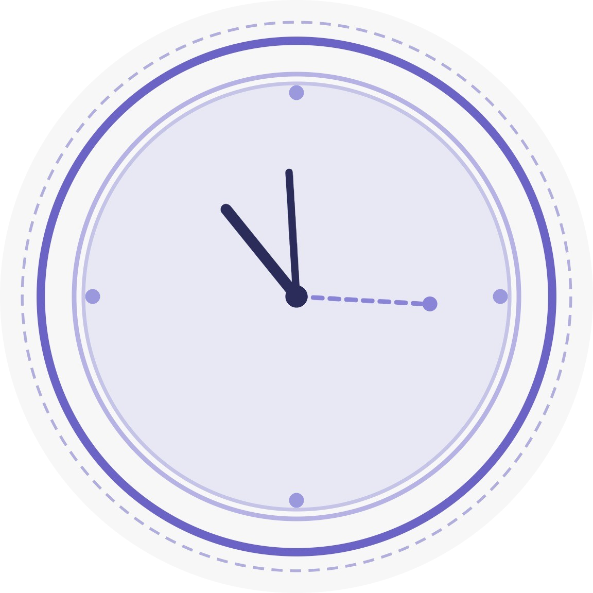
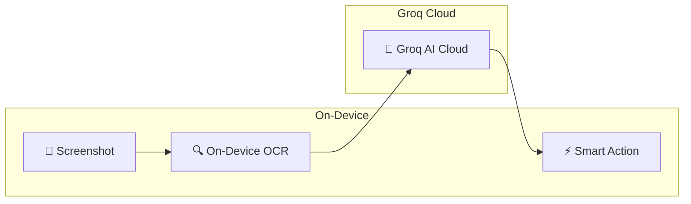

#  LaterLens — AI-Powered Screenshot Assistant

<p align="center">
  
</p>

> **Your screenshots, actionable.** LaterLens is an AI-powered mobile app that reads your screenshots, understands context with **Groq Cloud (Llama 3.1)** + on-device OCR, and creates a smart feed of tasks, reminders, and actions — all processed securely on your device.

<p align="center">
  
  
  
  
  <a href="docs/ARCHITECTURE.md"></a>

</p>

---

## ✨ Features

- 📸 **Auto Screenshot Analysis** — Fetches your latest screenshot and runs on-device OCR + **Groq AI** to extract intent
- 🧠 **Smart Categorisation** — AI classifies screenshots into Product, Study Material, Idea, Code, Event, or Receipt
- ⚡ **Action Queue** — A priority feed of actionable items with suggested next steps (e.g. "Add to Calendar", "Buy Now")
- 🎯 **Quick Actions** — Complete, Snooze, or Archive items with haptic feedback and smooth animations
- 📂 **Collections** — Browse all processed screenshots organised by category
- 🤖 **Ask AI** — Chat with AI about your screenshots for deeper insights
- 📊 **Insights & Streaks** — Track your productivity patterns
- ⚙️ **Advanced Settings** — Privacy exclusion rules, auto-archive housekeeping, and Wi-Fi only processing modes
- 🔔 **Intelligent Scheduling** — Daily digest summaries and quiet hours to protect your focus
- 🌗 **Premium Light & Dark Themes** — Automatic system-aware theming with carefully crafted palettes
- 🔒 **Privacy-First** — All OCR processing happens on-device; only extracted text goes to **Groq API**

---

## OCR Accuracy System (4 Layers)

LaterLens uses a 4-layer OCR pipeline designed for difficult screenshots (dark mode UIs, mixed Hindi-English text, dense layouts, and low-contrast cards), while keeping all image handling fully on-device.

1. **Layer 1: Preprocessing (On Device)**
  - Tone detection (`light`, `dark`, `mixed`) from a center strip of the screenshot
  - Resize and PNG conversion via `expo-image-manipulator`
  - Color/filter transforms via `@shopify/react-native-skia` only:
    - dark mode: greyscale -> invert -> sharpen
    - light mode: sharpen
    - mixed tone: contrast boost -> sharpen
2. **Layer 2: Multi-Script OCR**
  - ML Kit LATIN pass always runs
  - DEVANAGARI pass runs only when the screenshot is likely from an Indian app
3. **Layer 3: Post-Processing**
  - UI chrome filtering (status bar text, nav labels, social action labels)
  - Edge-region trimming, confidence filtering, deduplication, reading-order sorting
  - Paragraph assembly and confidence grading (`low` / `medium` / `high`)
4. **Layer 4: Confidence Retry**
  - If low-word output is detected on non-inverted paths, apply contrast boost retry
  - Compare retry output vs initial output and keep the better result

### Detect Text UX

The **Detect Text** action on each card provides visible progress states:

- `idle`: ready state with outlined button
- `processing`: stage label updates in real time (prepare, detect, Hindi pass, clean, retry)
- `success`: detected word count, confidence badge, optional Hindi badge, expandable text preview
- `failed`: recoverable error with retry prompt

### Performance and Safety Constraints

- OCR image preprocessing and recognition remain 100% on-device
- No paid OCR service is used
- Temporary files are cleaned up in `finally` blocks to avoid cache growth
- Target pipeline latency: up to ~8 seconds on mid-range Android hardware
- OCR debug logging is gated behind a `DEBUG` flag and disabled by default

---

## Design System

### Light Theme
| Element | Colour |
|---|---|
| Background | `#F9FAFB` |
| Card Surface | `#FFFFFF` + soft shadow |
| Primary Accent | `#6366F1` (Indigo) |
| Text Primary | `#111827` |
| Text Secondary | `#6B7280` |

### Dark Theme
| Element | Colour |
|---|---|
| Background | `#0F172A` (Deep Slate) |
| Card Surface | `#1E293B` + subtle border |
| Primary Accent | `#818CF8` (Vibrant Indigo) |
| Text Primary | `#F8FAFC` |
| Text Secondary | `#9CA3AF` |

### Category Badge Colours
Each AI category gets a unique semantic colour for instant visual recognition:
- 🟢 **Product** — Green tint
- 🔵 **Study Material** — Blue tint
- 🟡 **Idea** — Amber tint
- 🌿 **Code** — Forest green tint
- 🩷 **Event** — Pink tint
- 🟣 **Receipt** — Purple tint

---

## Project Structure

```
LaterLens/
├── App.js                          # Root component (Navigation + Providers)
├── app.json                        # Expo configuration
├── index.js                        # Entry point
├── .env                            # Secret env vars (git-ignored)
├── .env.example                    # Key template (committed)
├── package.json
├── assets/                         # Icons, splash screen images, brand assets
└── src/
    ├── theme/
    │   ├── colors.js               # Design tokens (palettes, typography, spacing)
    │   └── useTheme.js             # Central theme hook (useColorScheme)
    ├── components/
    │   └── ActionCard.js           # Premium action card with haptics & animations
    ├── screens/
    │   ├── home/
    │   │   ├── PermissionsScreen.js # Onboarding with animated glow icon
    │   │   ├── HomeQueueScreen.js   # Main action feed with branded header
    │   │   └── ActionDetailScreen.js# Full detail view for an action
    │   ├── collections/            # Collection browsing screens
    │   ├── askAI/                  # AI chat screens
    │   └── insights/               # Stats & streak screens
    ├── navigation/
    │   ├── AppNavigator.js         # Tab + Stack navigators (themed)
    │   └── routeNames.js          # Route name constants
    ├── state/
    │   ├── QueueContext.js         # Global queue state (React Context)
    │   └── SettingsContext.js      # Global settings management (Wi-Fi, Privacy, etc.)
    ├── services/
    │   ├── aiProcessingEngine.js   # OCR + Groq Cloud (Llama 3.1) pipeline
    │   ├── dataManagementService.js# Bulk import, Export & Storage stats
    │   ├── notificationService.js  # Quiet hours & Digest logic
    │   └── actionQueueStorage.js   # AsyncStorage persistence
    ├── models/
    │   └── actionModels.js         # Content types, intents, statuses
    └── utils/
```

---

## Architecture

LaterLens follows a **Privacy-First** architecture where heavy processing (OCR) happens entirely on-device. Only anonymised text is sent over the cloud for AI analysis.



For a deep dive into our system design, data flows, and component relationships, please see our **[Architecture Documentation](docs/ARCHITECTURE.md)**.

---

## 🚀 Getting Started

### Prerequisites

| Tool | Version |
|---|---|
| Node.js | 18+ |
| npm | 9+ |
| Git | 2.x+ |
| Expo CLI | Latest |
| Android Studio or Xcode | For emulator/simulator |
| Expo Go app | On your physical device |

### 1. Clone the Repository

```bash
git clone https://github.com/your-username/LaterLens.git
cd LaterLens
```

### 2. Install Dependencies

```bash
npm install
```

### 3. Set Up Environment Variables

```bash
cp .env.example .env
```

Open `.env` and add your **Groq API Key**:

```env
EXPO_PUBLIC_GROQ_API_KEY=gsk_your_groq_api_key_here
```

> Get your API key from the [Groq Cloud Console](https://console.groq.com/keys).

### 4. Run the App

```bash
npx expo start
```

This will start the Expo dev server and display a QR code in the terminal.

#### Option A — Physical Device (Recommended)

1. Install the **Expo Go** app on your phone:
   - [Android — Play Store](https://play.google.com/store/apps/details?id=host.exp.exponent)
   - [iOS — App Store](https://apps.apple.com/app/expo-go/id982107779)
2. Scan the QR code:
   - **Android**: Use the Expo Go app's built-in scanner
   - **iOS**: Use the default Camera app
3. The app will load on your device within seconds

#### Option B — Android Emulator

1. Make sure Android Studio is installed with an emulator configured
2. Start the emulator
3. Press `a` in the Expo terminal to open on Android

#### Option C — iOS Simulator (macOS only)

1. Make sure Xcode is installed
2. Press `i` in the Expo terminal to open on iOS Simulator

#### Option D — Development Build (for native modules)

Since this app uses `expo-media-library` and `@react-native-ml-kit/text-recognition` (native modules), you may need a development build for full functionality:

```bash
# Android
npx expo run:android

# iOS
npx expo run:ios
```

> **Note:** OCR and photo library access require a development build or a physical device. They won't work in Expo Go on all platforms.

---

## Tech Stack

| Layer | Technology |
|---|---|
| Framework | React Native 0.81 (Expo SDK 54) |
| Language | JavaScript (ES2022) |
| AI / LLM | **Groq Cloud (Llama 3.1 8B Instant)** |
| OCR | `@react-native-ml-kit/text-recognition` (on-device) |
| OCR Image Processing | `@shopify/react-native-skia` (colour matrix transforms) |
| Navigation | React Navigation 7 (Bottom Tabs + Native Stack) |
| State | React Context + useReducer |
| Storage | `@react-native-async-storage/async-storage` |
| Filesystem | `expo-file-system` |
| Networking | `expo-network` (Wi-Fi detection) |
| Notifications | `expo-notifications` |
| Sharing | `expo-sharing` |
| Icons | `lucide-react-native` |
| Haptics | `expo-haptics` |
| Theming | Custom design system + `useColorScheme` |
| Env | `dotenv` + `expo-constants` |

---

## 🔑 Environment Variables

| Variable | Required | Description |
|---|---|---|
| `EXPO_PUBLIC_GROQ_API_KEY` | ✅ | Your Groq Cloud API key |

---

## 📄 License

This project is private and not open for redistribution.
