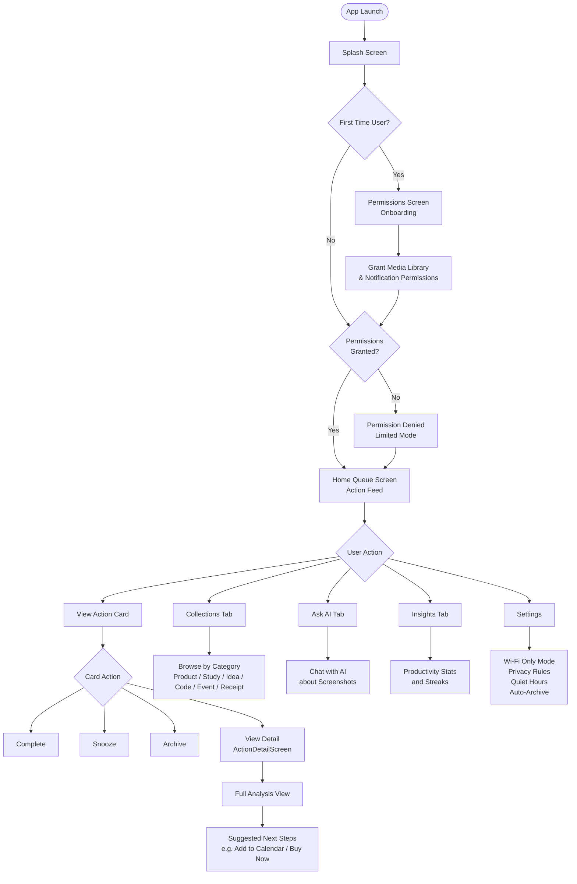
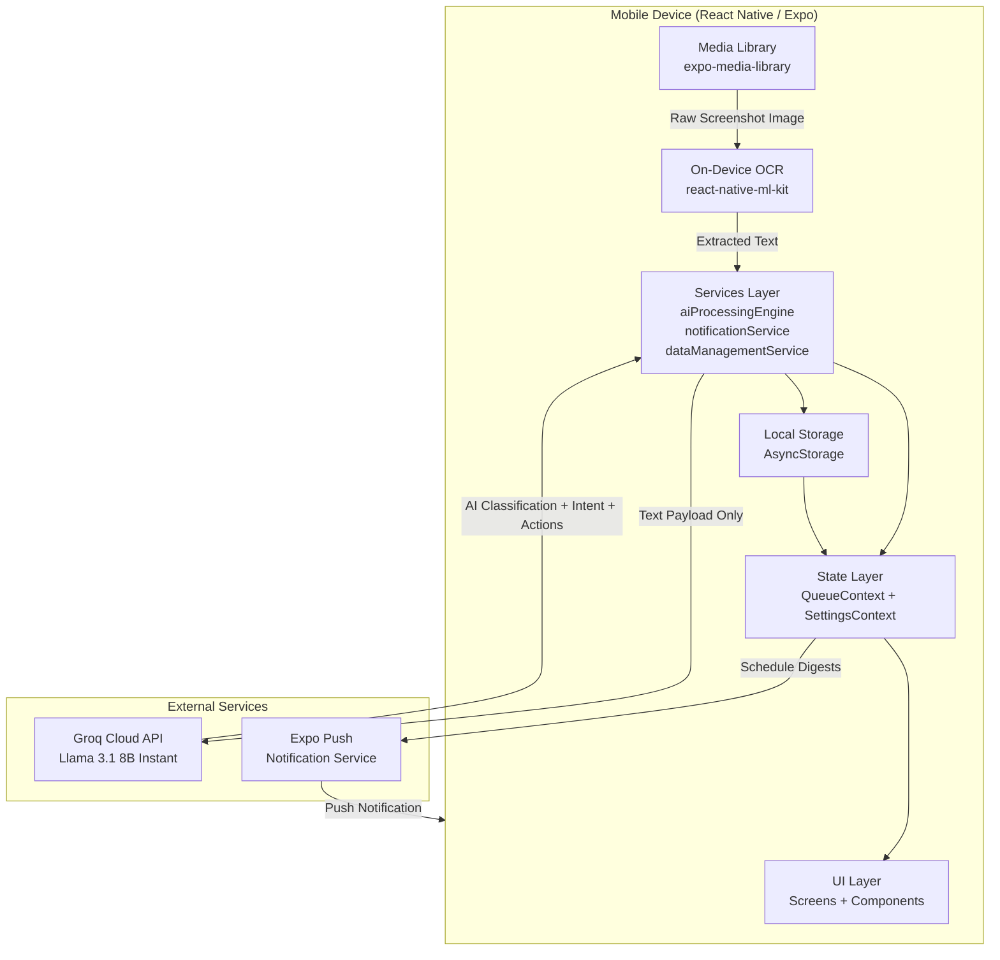
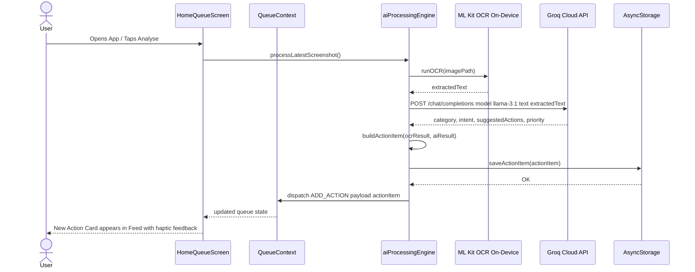
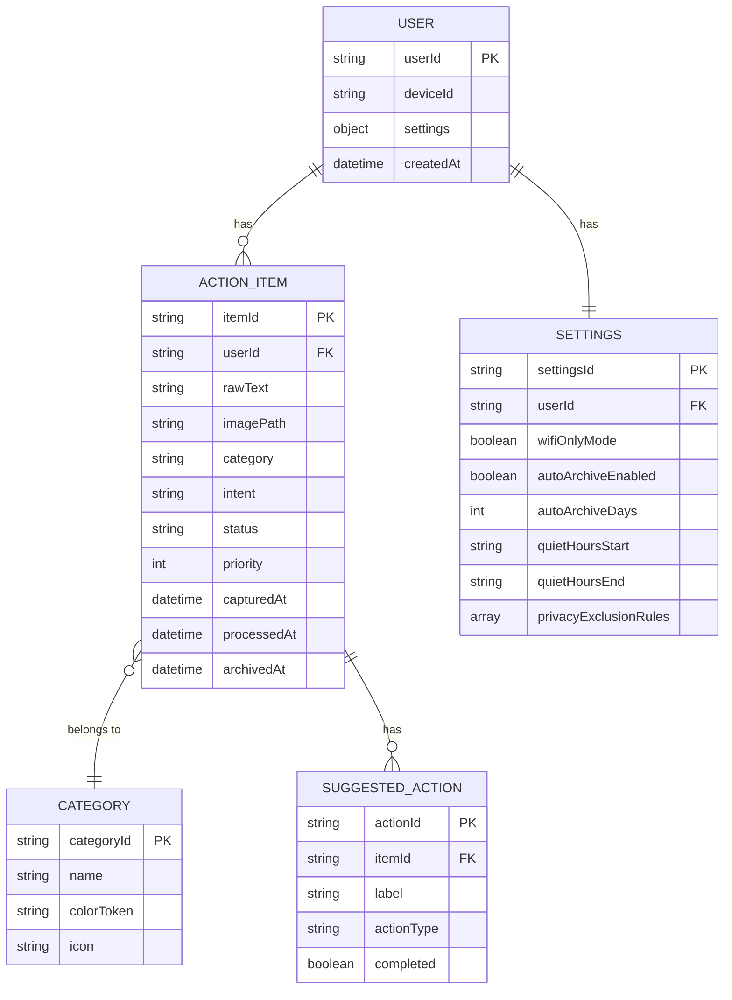
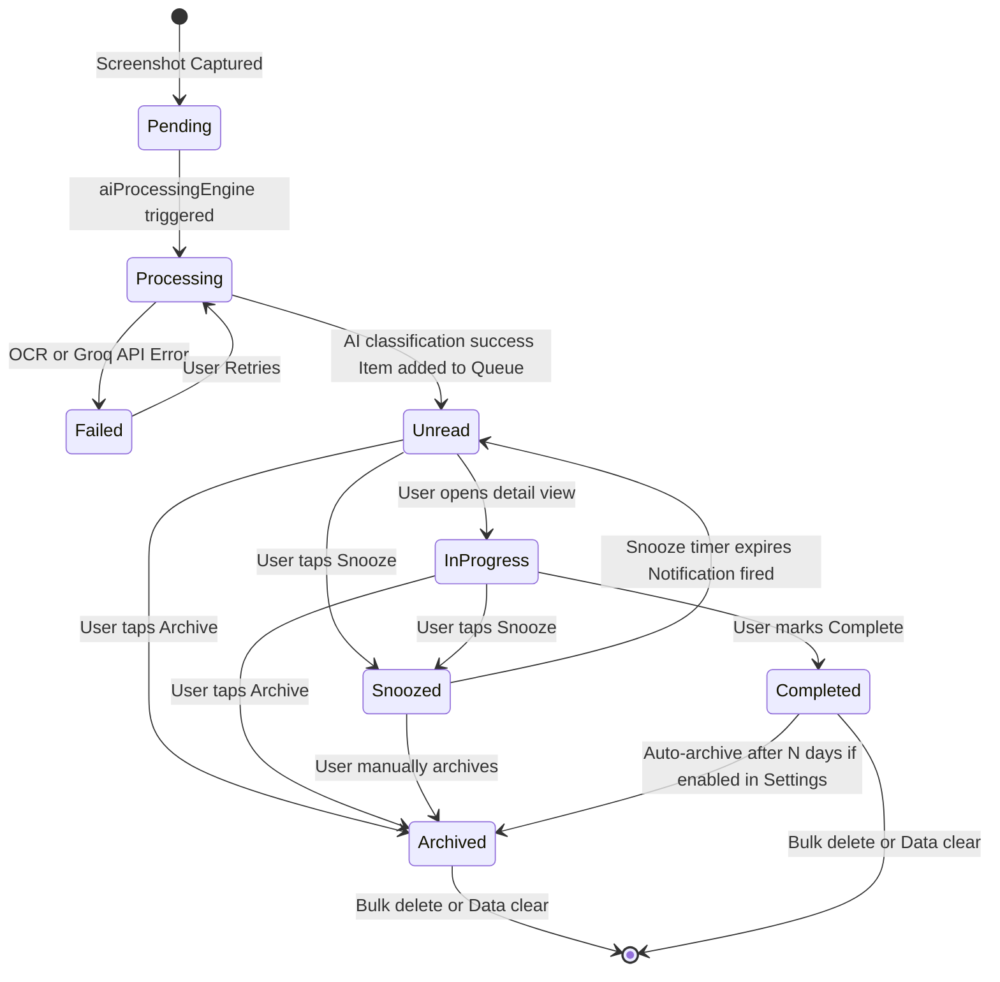
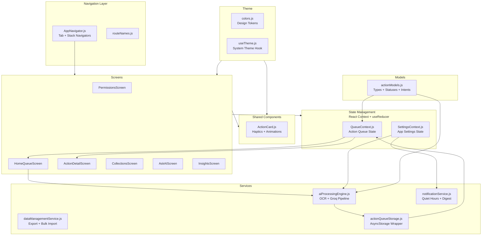
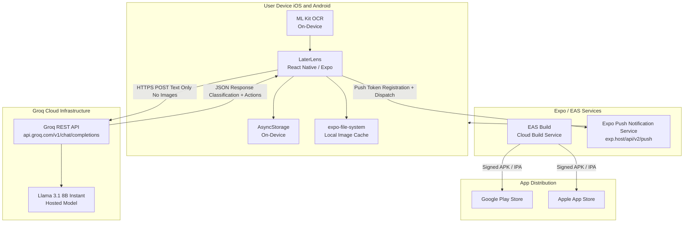
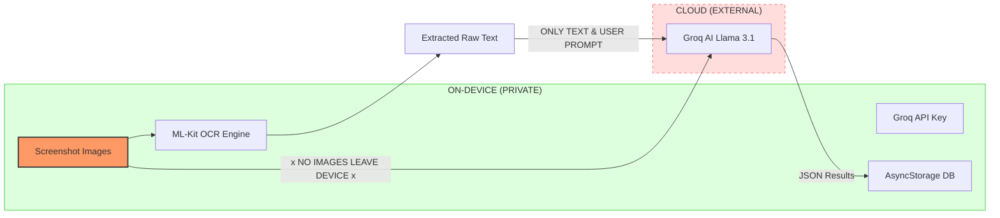

# 🏗️ Architecture & Technical Documentation

This document provides a deep dive into the internal design, data flow, and processing pipeline of **LaterLens**.

---

## 🚦 User Flow
Visualises the user journey from app launch through onboarding and daily interaction.

---

## 🏛️ System Architecture
The high-level interaction between local device capabilities and external AI processing.

---

## 🧬 Processing Sequence
The lifecycle of a single screenshot analysis request.

---

## 📊 Data Models (ERD)
Logic schema for how data is structured within local storage.

---

## 🔄 Screenshot State Lifecycle
Transitions of an action item from capture to final archive/deletion.

---

## 🧩 Internal Component Map
Module structure and internal dependency flow.

---

## 🌍 Edge & Cloud Deployment
Distribution through app stores and cloud-hosted AI inference.

---

## 🔒 Privacy & Data Boundary (Additional)
Visualises the "Privacy-First" approach by showing exactly what leaves the device.

